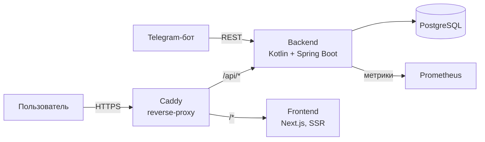

> **Статус проекта:** v0.1.0 — MVP-цикл собран: каталог+SEO, вход, кабинет, SM-2 практика, дашборд, Telegram-бот.

# Sobes — платформа подготовки к техническим собеседованиям

Веб-платформа, где разработчик системно готовится к собеседованиям и поддерживает знания: каталог вопросов с эталонными ответами, интервальные повторения, мок-интервью, аналитика слабых тем и Telegram-бот для ежедневной практики.

Ключевая идея — не «ещё один список вопросов», а тренажёр с расписанием повторений: платформа сама решает, что показать сегодня, исходя из ваших слабых тем и забывания.

## Что уже есть (v0.1.0)

- Каталог вопросов с фильтрами по теме и уровню (Junior / Middle / Senior), SSR-страницы для поисковиков: sitemap.xml, robots.txt, OpenGraph, JSON-LD QAPage.
- Стартовый банк: **112 вопросов** по Java, Kotlin, Spring, Kafka, PostgreSQL, Docker и смежным темам.
- Вход через **Telegram Login Widget** (JWT-сессии) и личный кабинет: таймзона, время напоминаний.
- **Практика SM-2**: карточки с самооценкой AGAIN/HARD/GOOD/EASY, due-очередь, интервальные повторения.
- **Дашборд**: прогресс по темам, слабые места, серия дней, готовность к собеседованию.
- **Telegram-бот** ([@sobes_auth_bot](https://t.me/sobes_auth_bot)): вопрос дня (1/сутки по вашему времени), напоминания о просроченных повторениях, практика прямо в чате, /stats.
- REST API с документацией OpenAPI; CI на GitHub Actions с интеграционными тестами (Testcontainers).

## Что в планах

- [ ] Проверка развёрнутых ответов через LLM
- [ ] Режим мок-интервью с таймером и итоговым отчётом
- [ ] Админка для наполнения банка вопросов (цель: 300+)
- [ ] Публичный запуск

## Стек

**Бэкенд:** Kotlin 2.4, Spring Boot 4.1, Java 21, PostgreSQL 16, Flyway, springdoc-openapi
**Фронтенд:** TypeScript, Next.js 16, React 19, Tailwind CSS 4
**Инфраструктура:** Docker Compose, Caddy (автоматический HTTPS), GitHub Actions
**Наблюдаемость:** Spring Boot Actuator, Micrometer, Prometheus

## Архитектура



Подробнее — в [docs/architecture.md](docs/architecture.md).

## Быстрый старт

Нужны JDK 21, Node.js 22+ и Docker.

```bash
# 1. Локальная конфигурация (один раз; оба файла игнорируются Git)
cp .env.example .env.local
cp frontend/.env.example frontend/.env.local
# Заполните TELEGRAM_BOT_TOKEN, JWT_SECRET и публичные настройки фронтенда.

# 2. База данных для разработки
docker compose -f infra/docker-compose.dev.yml up -d

# 3. Бэкенд (миграции применяются автоматически, .env.local загрузится сам)
cd backend && ./gradlew bootRun
# API:    http://localhost:8080/api/v1/questions
# Swagger: http://localhost:8080/swagger-ui.html

# 4. Фронтенд
cd frontend && npm install && npm run dev
# http://localhost:3000
```

## Запуск в продакшене

```bash
cd infra
cp .env.example .env
# Заполните .env: POSTGRES_PASSWORD, TELEGRAM_BOT_TOKEN, JWT_SECRET и DOMAIN.
docker compose up -d --build
```

Caddy сам получит сертификат Let's Encrypt. Файл `infra/.env` игнорируется Git и передаёт
секреты контейнерам через Docker Compose; коммитить его не нужно.

## Как мы работаем (ветки и PR)

Флоу — упрощённый GitFlow:

- `main` — стабильная ветка, всегда деплоябельное состояние. Мерж только через PR.
- `develop` — интеграционная ветка. Здесь собираются фичи между вехами.
- `feature/SOBES-N-краткое-имя` — ветка на задачу из Jira (номер обязателен в имени).
  По готовности — PR в `develop` (шаблон заполнить), ревью, зелёный CI, merge (squash).
- `hotfix/SOBES-N-...` — срочные фиксы: PR в `main` **и** в `develop` сразу (бэкпорт обязателен).
- `develop → main` — PR-пакетами к вехам (не после каждой фичи), мерж сопровождается тегом версии (`v0.1.0`, `v0.2.0`…).

Ветки `main` и `develop` защищены: обязательны зелёные чеки CI, force-push запрещён.

## Структура репозитория

```
backend/    Kotlin + Spring Boot: API, бизнес-логика, миграции Flyway
frontend/   Next.js: каталог вопросов, личный кабинет, лендинг
bot/        Telegram-бот (в разработке)
infra/      Docker Compose, конфигурация Caddy
docs/       Архитектура и проектные решения
```

## Тесты

```bash
cd backend && ./gradlew test     # интеграционные тесты на Testcontainers
cd frontend && npm run typecheck # проверка типов
```

## Лицензия

MIT — см. [LICENSE](LICENSE).
