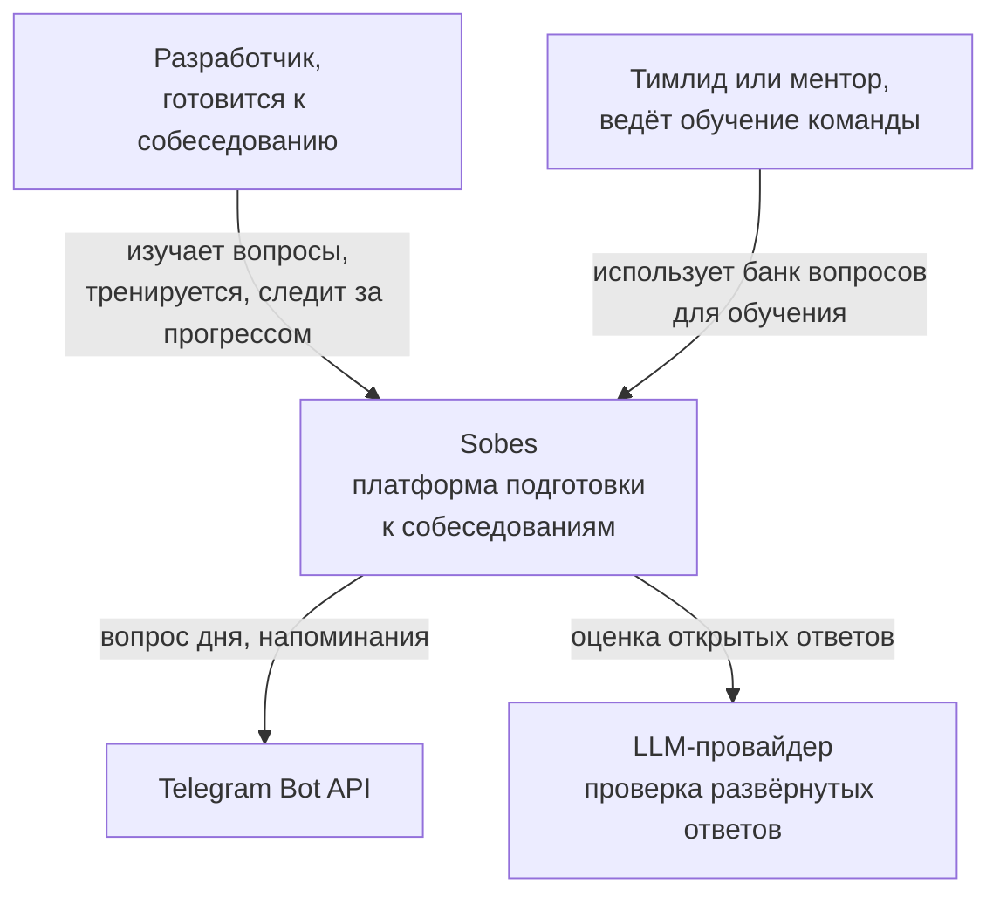
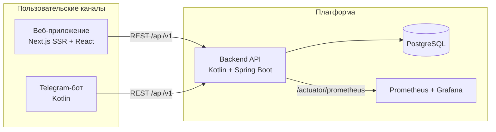

# Архитектура Sobes

Документ описывает целевую архитектуру платформы и решения, принятые на старте.

## Контекст (C4, уровень 1)

## Контейнеры (C4, уровень 2)

## Слои бэкенда

- `question` — каталог вопросов: сущности, репозитории, сервис, REST-контроллер, DTO.
- `user` — аккаунты и привязка Telegram (в разработке).
- `practice` — ответы пользователя и алгоритм интервальных повторений (в разработке).
- `mock` — режим мок-интервью (в разработке).

Правило: контроллеры не обращаются к репозиториям напрямую, только через сервисы; DTO отделены от JPA-сущностей, ленивые связи не утекают в JSON (`open-in-view` выключен).

## Модель данных

| Таблица | Назначение |
|---|---|
| `categories` | темы вопросов: slug, название, порядок сортировки |
| `questions` | вопрос, эталонный ответ, уточняющий вопрос, уровень |
| `users` | аккаунт пользователя |
| `telegram_accounts` | привязка Telegram-аккаунта к пользователю |
| `user_answers` | история ответов и самооценок |
| `review_schedule` | состояние SM-2 по паре пользователь/вопрос |

Миграции — Flyway, только вперёд (`V1__catalog`, `V2__seed_questions`, `V3__users_and_progress`).

## Принятые решения

**Монорепозиторий.** Бэкенд, фронтенд, бот и инфраструктура в одном репозитории: один CI, общие версии, удобный запуск одной командой. Для pet-проекта это дешевле в поддержке, чем несколько репозиториев.

**Серверный рендеринг фронтенда.** Каталог и страницы вопросов отдаются через SSR: поисковые системы индексируют вопросы с ответами, что даёт органический трафик и снижает стоимость привлечения пользователей.

**Интервальные повторения на бэкенде.** Алгоритм SM-2 живёт в сервисном слое, а не на клиенте: расписание повторений не должно зависеть от того, каким каналом (веб или Telegram) пользователь зашёл.

**Одна база PostgreSQL.** Без очередей и кэшей на старте: при ожидаемой нагрузке (десятки запросов в секунду) они не нужны и только усложняют эксплуатацию. Redis и Kafka появятся, когда возникнет измеренная необходимость.

**Docker Compose, а не Kubernetes.** Сервер 2 vCPU / 4 ГБ обслуживает весь стек. Манифесты Kubernetes будут добавлены позже как отдельный сценарий деплоя, но не как основная среда.

**Лимиты памяти у контейнеров.** Платформа живёт на том же сервере, что и агент разработки, поэтому у каждого сервиса явный `mem_limit`: 512 МБ у Postgres, 900 МБ у бэкенда, 512 МБ у фронтенда, 128 МБ у Caddy.

## Нефункциональные требования

- Время ответа API на каталоге — до 200 мс при 50 параллельных запросах (проверяется k6).
- Покрытие тестами бэкенда — не ниже 80 % по бизнес-логике.
- Секреты — только через переменные окружения, в репозитории хранится `.env.example`.
- Все изменения — через pull request с зелёным CI (сборка, тесты, проверка типов).
